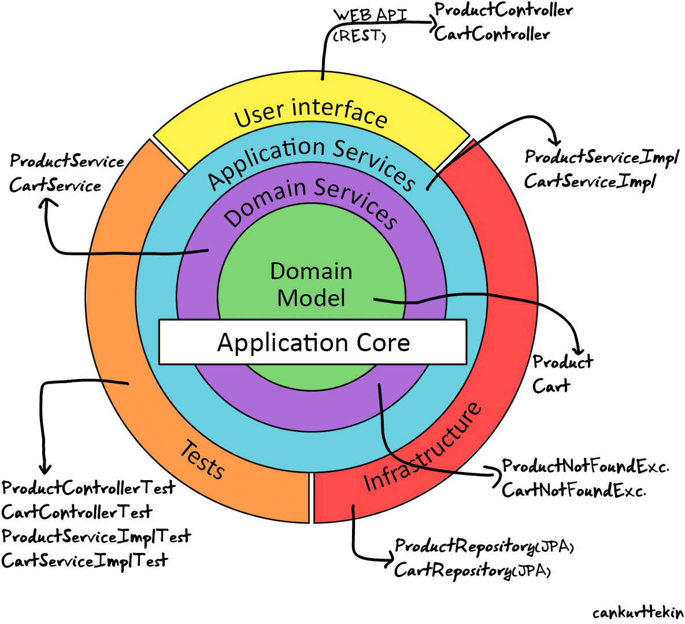

# Market
 
A Web API developed using **Spring Boot**, **Spring Data JPA** and **Spring Security** using Onion Architecture.

##
- Java 17
- Spring Boot
- Spring Data
- PostgreSQL
- Onion Architecture
- Domain Driven Design
- Unit Testing
- Object Oriented
- Design Patterns

  

## Endpoints

  
List of endpoints:

 
 
GET
/api/products 
Retrieve all products
ROLE=EMPLOYEE

POST
/api/products
Create new product
ROLE=MANAGER

GET
/api/products/{id}
Retrieve product by id
ROLE=EMPLOYEE

PUT
/api/products/{id}
Update product by id
ROLE=MANAGER

DELETE
/api/products/{id}
Delete product by id
ROLE=ADMIN

DELETE
/api/products/
Delete all products!
ROLE=ADMIN

GET
/api/products/available
Retrieve all available products
ROLE=EMPLOYEE

## Database
Role and users are in two tables with passwords stored as **bcrytp hash**, primary key being user_id in a members table.
 

